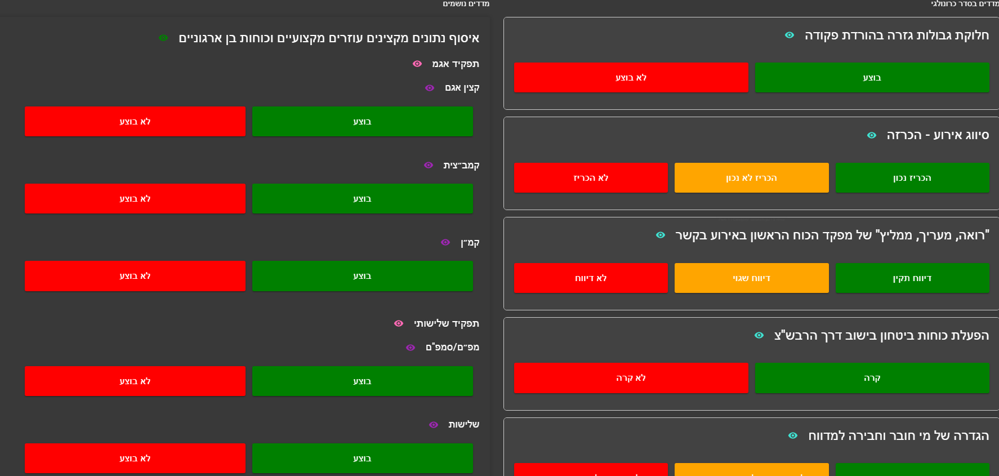

# DCA-Webapp 🚀

[](https://github.com/omri1001/dca-webapp/issues)
[](https://github.com/omri1001/dca-webapp/network)
[](https://github.com/omri1001/dca-webapp/stargazers)
[](LICENSE)


## Table of Contents

- [Overview](#overview)
- [Key Functionalities](#key-functionalities)
- [Screenshots](#screenshots)
- [Repository Structure](#repository-structure)
- [Setup & Installation](#setup--installation)
- [Environment Variables](#environment-variables)
- [Built With](#built-with)
- [Future Enhancements](#future-enhancements)
- [License](#license)
- [Contributing](#contributing)

---

## Overview

**DCA-Webapp** is a full-stack web application built with **TypeScript** and **Material-UI (MUI)** on the client side and **Node.js** with **Express** on the server side. It demonstrates advanced functionalities including report creation, data processing with a Large Language Model (LLM) via Retrieval-Augmented Generation (RAG), interactive data visualization, multi-parameter filtering, and report editing. *All data in the application is mock data used for demonstration.*

### Key Functionalities

1. **📝 Report Creation & Processing:**  
   - **Input:** Users create reports by inserting text and grades into designated fields.  
   - **Processing:** Reports are sent to a database and processed by an LLM via RAG, adding advanced capabilities to your application.
   
2. **📊 Data Analysis & Visualization:**  
   - **Visualization:** Interactive charts and text-based visualizations (using libraries like Recharts and Chart.js) display report insights.
   
3. **🔍 Advanced Filtering:**  
   - **Filtering:** Users can apply multiple parameters to filter and quickly find relevant data.
   
4. **✏️ Editing Existing Reports:**  
   - **Edit:** Update or modify reports seamlessly to reflect changes or corrections.

> **Note:** All functionalities currently use mock data for demonstration purposes.

---

## Screenshots
### all the screenshots its not real data

### Report Creation
  
*Insert text and grades into user-friendly fields for generating new reports.*

### Data Visualization (Details)
  
*Dive into detailed data insights with color-coded layouts.*

### Data Visualization (Graphs)
  
*Leverage interactive bar or line graphs to gain a quick overview of trends.*

### Data Visualization (Scenarios) - (get by LLM abilities -RAG & Agents)
  
*Explore different scenarios or configurations with dynamic chart displays.*

### Filtering & Editing
  
*Easily filter and edit reports to find or update specific data points.*

---


## 📁 Repository Structure

```bash
dca-webapp/
├── react-mui-vite-ts/    # Client (React + MUI + Vite + TS)
│   ├── package.json
│   ├── vite.config.ts
│   └── ...
└── server/               # Server (Node.js + Express)
    ├── package.json
    └── server.js

```
---

## Setup & Installation 🛠️

### Prerequisites

- **Node.js** (v14+ recommended) 🔧
- **npm** (v6+ recommended) 📦

### Client Setup

1. Navigate to the client folder:
    ```bash
    cd react-mui-vite-ts
    ```
2. Install dependencies:
    ```bash
    npm install
    ```
3. Start the client:
    ```bash
    npm start
    ```
---
### Server Setup

1. Navigate to the server folder:
    ```bash
    cd server
    ```
2. Install dependencies:
    ```bash
    npm install
    ```
3. Start the server:
    ```bash
    npm start
    ```

---


## Environment Variables 🔐

For the server to interact with GPT-4 and other services, create a `.env` file in the `server` folder and add:

```env
OPENAI_API_KEY=<your-openai-api-key>
MONGODB_URI=<your-mongodb-connection-string>

```

## Built With 🛠️

### Client:
- ⚛️ **React**
- 🎨 **Material-UI (MUI)**
- ⚡ **Vite**
- 📘 **TypeScript**
- 🛣️ **React Router**
- 📈 **Recharts**
- 🔄 **Axios**

### Server:
- 🟢 **Node.js**
- 🚀 **Express**
- 🐵 **Mongoose (MongoDB)**
- 🤖 **OpenAI API**
- 📊 **Chart.js**
- 📝 **Docx & Docxtemplater**
- 📄 **PDF-lib**
- 🖨️ **Officegen**
- *...and other utility packages*


## Future Enhancements 🚀

- **Live Data Integration:** Replace mock data with live data sources.
- **Expanded Reporting:** Add additional report templates and richer editing features.
- **User Authentication:** Implement secure, role-based access for report management.
- **UI/UX Improvements:** Continuously enhance the user interface for an even more interactive experience.

